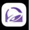
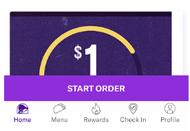
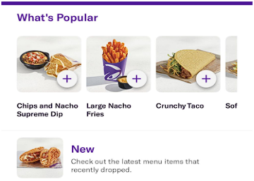
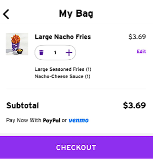
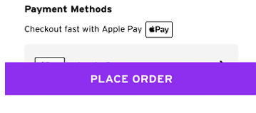

# Instructions

How to Order Nacho Fries on the Taco Bell App (iPhone)

Step 1: Press the Taco Bell app icon on the home screen

Figure 1. Taco Bell App Icon (Screenshot by Jordan Rodriguez)

Step 2: Press the purple Start Order button at the bottom of the screen

Figure 2. Home Screen (Screenshot by Jordan Rodriguez)

Step 3: Tap the plus icon next to the image showing Nacho Fries

Figure 3. Menu Screen (Screenshot by Jordan Rodriguez)

Step 4: Press the purple View My Bag button at the bottom of the screen

Step 5: Press the purple Checkout button at the bottom of the screen

Figure 4. My Bag Screen (Screenshot by Jordan Rodriguez)

Step 6: If prompted to add more items, press Skip

Step 7: Press the Drive-Thru button to select it as your pickup method

Figure 5. Pickup Method Selection (Screenshot by Jordan Rodriguez)

Step 8: Press the purple Place Order button at the bottom of the screen

Figure 6. Place Order button (Screenshot by Jordan Rodriguez)

Step 9: Confirm the payment with Apple Pay by double-pressing the power button on the side of your iPhone.

Step 10: Wait 30 seconds for the confirmation message that your order has been placed.

Step 11: Close the app.

Step 12: Drive to your Taco Bell location.

Step 13: When at the speaker, tell the employee "Hello, I have a mobile order for…" and say your name. They will then tell you to pull forward.

Step 14: Pull forward to the next window and wait for the employee to hand you your food.
